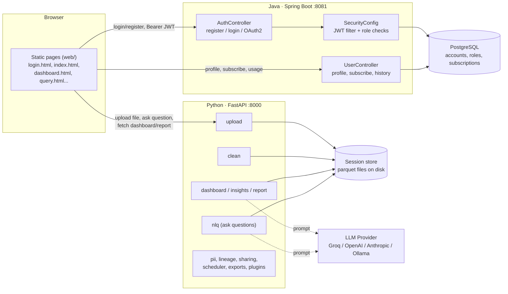
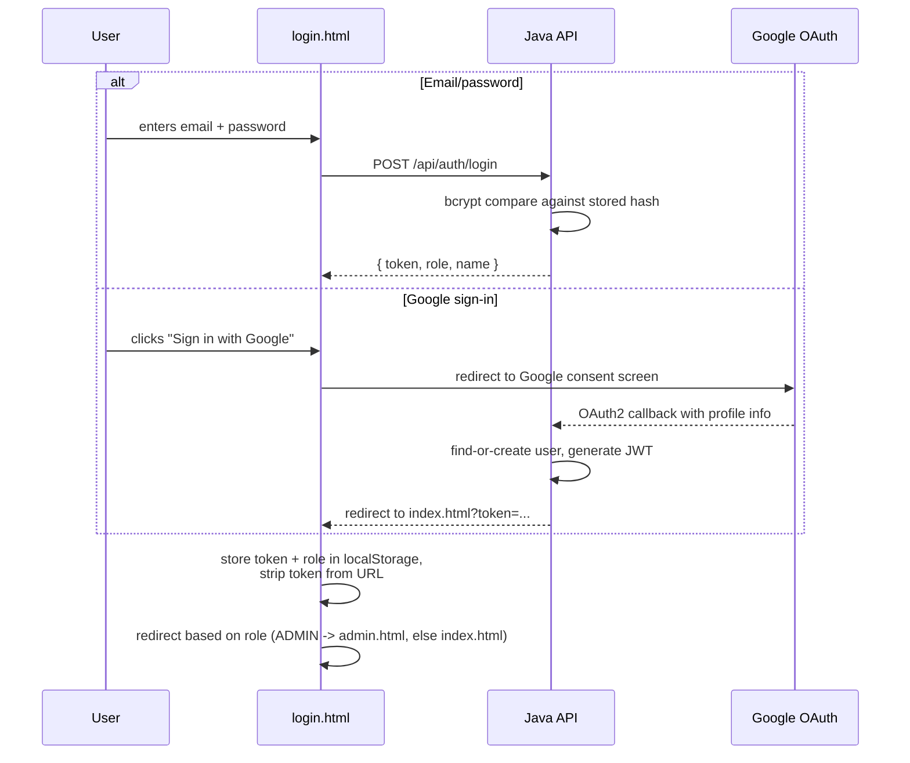
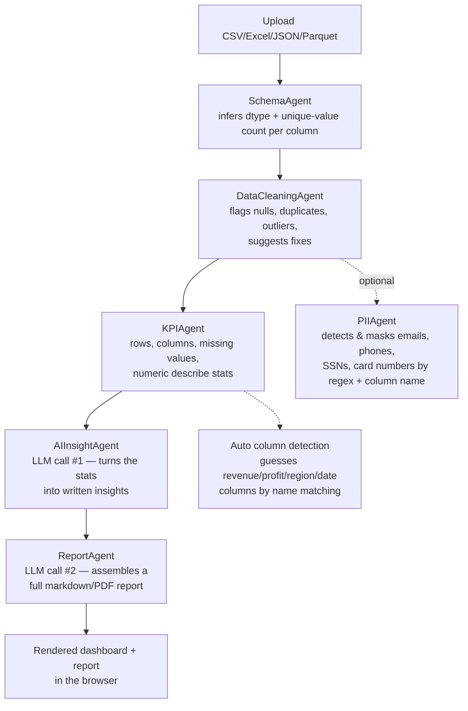

# AI Business Analyst

An AI-powered analytics tool you point at a spreadsheet and get back a cleaned dataset, auto-generated KPIs, a natural-language Q&A interface, and a written business report — without writing a single line of pandas yourself.

Upload a CSV (or Excel/JSON/Parquet), and behind the scenes a chain of small "agents" profile the schema, flag data quality issues, compute KPIs, and hand everything to an LLM to turn into human-readable insights and a report. There's also a full account system on top — login, subscription tiers, usage limits — because this is built like something meant to actually be run as a product, not just a notebook demo.

## What it's made of

This isn't a single app — it's three separate pieces glued together:

1. **A Python/FastAPI service** that does all the actual analysis work — file parsing, cleaning, KPI generation, LLM calls, report/PDF export, natural-language querying, scheduling, PII detection, plugins. This is the core.
2. **A Java/Spring Boot service** that only handles accounts — registration, login (email/password *and* Google OAuth2), JWT issuing, subscription plans, and admin/role management. It talks to its own Postgres database.
3. **A static HTML/CSS/JS frontend** (`web/`) that's just... served by the Python app. No React, no build step — plain pages calling both backends with `fetch()`.

Why split auth into a separate Java service instead of just doing it in FastAPI? Honestly it looks like a deliberate choice to demo a polyglot setup (or possibly the auth layer was built by someone more comfortable in Spring). Either way, it works, and the two backends don't know much about each other beyond both trusting the same shape of JWT.

## Stack

| Piece | Tech |
|---|---|
| Analysis API | Python, FastAPI, pandas, LangChain |
| LLM providers | Groq (default), OpenAI, Anthropic, or local Ollama — swappable at runtime |
| Auth/accounts API | Java 17, Spring Boot, Spring Security, JPA |
| Databases | PostgreSQL (accounts) + flat files/parquet for session data |
| Frontend | Static HTML/CSS/vanilla JS |
| Reports | fpdf2, markdown |

## How a request actually flows

Two backends, one frontend, and the frontend talks to both directly:



The two APIs are only loosely coupled — the Java side never touches your uploaded data, and the Python side doesn't know who you are beyond whatever the frontend already validated. Sessions from an upload live as parquet files on disk under a `session_id`, not tied to a user account at the database level (worth knowing if you're thinking about deploying this multi-tenant as-is).

## Login flow



Every other page checks `localStorage` for a token on load (`app.js` runs this on every page) and bounces you back to `/login.html` if it's missing — this is client-side gating, not a server-enforced redirect, since the static pages are served with no auth check at all.

## The actual data pipeline

This is the part that matters — what happens between "I uploaded a CSV" and "I have a dashboard":



This whole thing is orchestrated by `SupervisorAgent.run()`, which just calls each agent in order and hands the output forward — schema → cleaning → KPIs → insights (LLM) → report (LLM). Two LLM calls per run, which is worth knowing if you're watching your API usage.

Separately from that pipeline, there's an **NLQ (natural language query)** flow — you type a question like "what's the average order value," it builds a text summary of the dataframe (column stats + a 5-row sample), asks the LLM to answer in structured JSON with an optional chart spec, and the frontend renders whatever chart type comes back (bar/line/pie/doughnut/number/table).

## Accounts, roles, and limits

The Java side isn't just login — it enforces a real subscription model:

- **Roles:** `USER`, `PREMIUM_USER`, `ADMIN` — checked directly in Spring Security's route matchers (`/api/admin/**` needs `ADMIN`, `/api/premium/**` needs `PREMIUM_USER` or `ADMIN`).
- **Plans:** `FREE` (5 dashboards/month), `STARTER` ($27/3mo, 50/month), `PROFESSIONAL` ($42/6mo, 200/month), `ENTERPRISE` ($60/12mo, unlimited).
- Every dashboard generation increments a per-user counter that resets monthly; hit the limit and the API returns a 403 with `limit_reached: true` instead of the dashboard.
- Payment is handled by `PaymentGatewayService` — worth flagging that right now it's a **simulated gateway**: it doesn't call Stripe or anyone else, it just fakes a transaction ID unless the token you send contains the word "decline" or "fail." Fine for demoing the upgrade flow, not something to point at real money without swapping it out.

## Project structure

```
AI-Business-Analyst/
├── agents/                  # the actual analysis logic
│   ├── schema_agent.py          # column types + cardinality
│   ├── cleaning_agent.py        # data quality checks (the big one, ~40K)
│   ├── kpi_agent.py              # row/col counts, describe() stats
│   ├── ai_insight_agent.py       # LLM call: stats -> written insights
│   ├── report_agent.py           # LLM call: insights -> full report
│   ├── nlq_agent.py               # natural language Q&A over the dataframe
│   ├── pii_agent.py                # regex + column-name PII detection/masking
│   ├── compare_agent.py            # dataset-vs-dataset comparison
│   ├── smart_dashboard_agent.py    # auto-generated dashboard layout
│   ├── visualization_agent.py      # chart spec generation
│   └── supervisor_agent.py         # runs schema -> clean -> kpi -> insight -> report
│
├── api/
│   ├── main.py               # FastAPI app, mounts routers + serves web/ as static
│   ├── session_store.py      # save/load uploaded dataframes as parquet by session_id
│   ├── scheduler_daemon.py   # background job for scheduled report runs
│   └── routers/              # one file per feature: upload, clean, dashboard,
│                              # insights, report, nlq, pii, lineage, sharing,
│                              # scheduler, exports, plugins, compare, history, llm_settings
│
├── backend-java/
│   └── src/main/java/com/example/analytics/
│       ├── controller/        # AuthController, UserController, AdminController, IndexController
│       ├── config/             # SecurityConfig (JWT filter, OAuth2, CORS), JwtUtil
│       ├── model/               # User (roles/plan/usage baked in), DashboardHistory
│       ├── repository/          # Spring Data JPA repos
│       └── service/              # PaymentGatewayService (simulated)
│
├── config/
│   └── llm_manager.py        # provider-agnostic LLM factory (Groq/OpenAI/Anthropic/Ollama),
│                              # config persisted to data/config/llm_config.json
│
├── utils/                    # helpers: sample data, lineage tracking, exports, plugin loader
├── web/                      # static frontend — one HTML page per feature
├── data/                     # session parquet files, lineage logs, sharing tokens, schedules
├── reports/                  # generated markdown reports land here
├── docker-compose.yml        # postgres + java-backend + python-api, three containers
└── requirements.txt
```

## Beyond the core pipeline

A few things that go beyond "upload a CSV, get a dashboard," in case they're not obvious from the file names:

- **Lineage tracking** — every transformation (upload, cleaning step, PII masking) gets logged with before/after row and column counts, so you can trace exactly what happened to your data.
- **Sharing** — dashboards can apparently be shared via a token/link (`sharing.py`, `share.html`, `share-manage.html`).
- **Scheduled reports** — a background daemon (`scheduler_daemon.py`) that can regenerate reports on a schedule.
- **Plugins** — there's a `plugin_manager.py`/`plugin_base.py` pair suggesting an extensibility point for custom agents, plus a `plugins.html` page.
- **Compare mode** — run two datasets against each other (`compare_agent.py`, `compare.html`).
- **Governance/PII page** — a dedicated screen for reviewing detected PII and choosing what to mask.

I haven't traced every one of these end-to-end, so treat that list as "here's what exists," not a guarantee everything is fully wired up.

## Running it

### Environment variables

Create a `.env` in the repo root:

```env
GROQ_API_KEY=your_groq_api_key_here

GOOGLE_CLIENT_ID=your_google_client_id
GOOGLE_CLIENT_SECRET=your_google_client_secret
```

You only strictly need `GROQ_API_KEY` to get the analysis pipeline running — Groq is the default provider. OpenAI/Anthropic/Ollama can be configured later from the settings page without touching `.env` (it writes to `data/config/llm_config.json` instead). Google OAuth is optional if you're fine using email/password login.

### Docker Compose (easiest)

```bash
docker-compose up --build
```

Spins up three containers — Postgres, the Java auth service, and the Python API/frontend.

- Web app: `http://localhost:8000`
- Java auth API: `http://localhost:8081`

### Running it by hand

**Python API + frontend:**
```bash
python -m venv .venv
.venv\Scripts\activate          # or source .venv/bin/activate on Linux/Mac
pip install -r requirements.txt
uvicorn api.main:app --host 0.0.0.0 --port 8000 --reload
```
Then open `http://localhost:8000`.

**Java auth backend:**

You'll need Postgres running locally with a database called `ai_analyst_db`, then:
```bash
cd backend-java
./mvnw spring-boot:run
```

## A couple of things worth knowing before deploying this anywhere real

- The payment gateway is fully simulated — see above.
- Route protection on the frontend is client-side only (a script checks `localStorage` and redirects); the static file server itself doesn't enforce auth on `web/*.html`.
- Uploaded data sessions aren't linked to a user account at the storage layer — anyone with a `session_id` can pull that data back via the API.
- None of that is unusual for a project at this stage, just flagging it since the README used to describe this as more "production-ready" than the code currently backs up.
